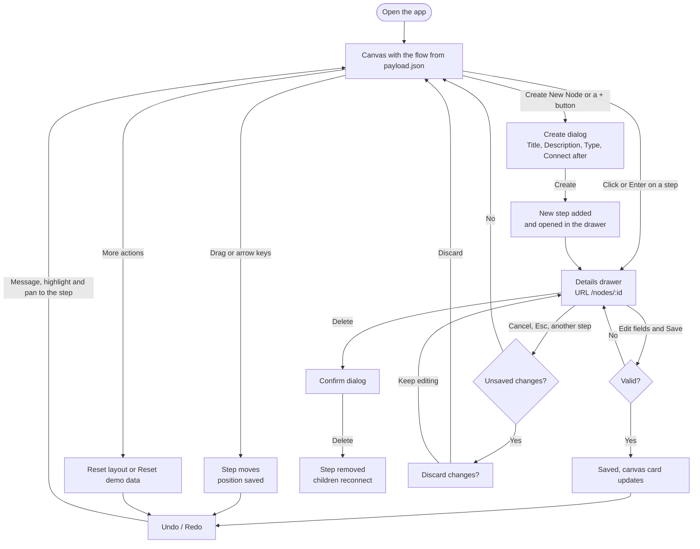

# Flow Chart

A visual editor for a chat automation flow, built with Vue 3 for the respond.io frontend
assignment. It loads a flow from `payload.json`, draws it as a tree on a canvas, and lets you
create, edit, move and delete steps. It also has undo/redo, protection against losing unsaved
changes, and full keyboard support.

## Important links

|                 | Link                                         |
| --------------- | -------------------------------------------- |
| Production      | _add the Vercel URL here_                    |
| GitHub          | _add the repository URL here_                |
| Assignment data | [`public/payload.json`](public/payload.json) |

## Contents

1. [Overview](#overview)
2. [Installation and usage](#installation-and-usage)
3. [Scripts](#scripts)
4. [Features](#features)
5. [UI/UX flow](#uiux-flow)
6. [Tech stack](#tech-stack)
7. [Project structure](#project-structure)
8. [Data model](#data-model)
9. [API contract (fake backend)](#api-contract-fake-backend)
10. [Data layer (TanStack Query)](#data-layer-tanstack-query)
11. [Router configuration](#router-configuration)
12. [Store management (Pinia)](#store-management-pinia)
13. [Composables](#composables)
14. [Helper functions](#helper-functions)
15. [Components](#components)
16. [Design decisions](#design-decisions)
17. [Gaps in the brief and how they were filled](#gaps-in-the-brief-and-how-they-were-filled)
18. [Accessibility](#accessibility)
19. [Testing](#testing)
20. [Continuous integration](#continuous-integration)
21. [Known limitations](#known-limitations)

## Overview

The flow is a tree of steps. It starts with a **Trigger** ("Conversation Opened"). Each step points to the
step before it through `parentId`. There are three step types:

- **Send Message:** sends texts and image attachments.
- **Add Comment:** an internal note for the team.
- **Business Hours:** branches into **Success** (inside business hours) and **Failure** (outside
  them).

The app shows this tree on a zoomable canvas. Clicking a step opens its details in a side drawer
with the URL `/nodes/<id>`. From there you can edit or delete the step. New steps are added from the toolbar or from
the "+" buttons on the canvas.

There is no backend: a small fake API stores the flow in the browser, so every change survives a
reload.

## Installation and usage

**Requirements:** Node.js 22.22.2 or newer (some dependencies need it), and Yarn 1.

Versions are pinned with [Volta](https://volta.sh) in `package.json` (Node 22.23.3, Yarn 1.22.22).
With Volta installed, the right versions are used automatically. Without it, `nvm use` reads
`.nvmrc`.

1. Clone the repository: `git clone <repository URL>`
2. Go to the project folder: `cd flow-chart`
3. Install dependencies: `yarn`
4. Start the dev server: `yarn dev`, then open http://localhost:5173
5. Optional, for the browser tests: `npx playwright install chromium` (once)

**Data and resetting.** On first load the fake API reads `public/payload.json`. After that, every
change is saved in `localStorage` (`flow-chart:nodes` for the flow, `flow-chart:positions` for
dragged positions). To start again from the original payload, use **More actions (⋮) → Reset demo
data…** in the toolbar.

**Deploying.** `yarn build` outputs a static site to `dist/`. On Vercel, `vercel.json` rewrites
every path to `index.html`, so deep links like `/nodes/b6a0c1` work on refresh.

## Scripts

| Command              | What it does                                                          |
| -------------------- | --------------------------------------------------------------------- |
| `yarn dev`           | Dev server with hot reload                                            |
| `yarn build`         | Type-check, then build for production into `dist/`                    |
| `yarn preview`       | Serve the production build locally                                    |
| `yarn type-check`    | TypeScript check of the app, tests and config (`vue-tsc --build`)     |
| `yarn lint`          | ESLint with auto-fix (Vue, TypeScript and accessibility rules)        |
| `yarn lint:check`    | ESLint without fixing (for CI)                                        |
| `yarn format`        | Format `src/`, `tests/` and `e2e/` with Prettier                      |
| `yarn format:check`  | Check formatting without writing                                      |
| `yarn test`          | Unit and component tests in watch mode (Vitest)                       |
| `yarn test:run`      | Unit and component tests once                                         |
| `yarn test:coverage` | Unit and component tests with a coverage report in `coverage/`        |
| `yarn test:e2e`      | Browser tests (Playwright): WCAG 2.1 AA scans and keyboard-only flows |
| `yarn test:a11y`     | Only the WCAG 2.1 AA scans                                            |

## Features

### Canvas

- Steps from `payload.json`, laid out automatically as a top-down tree.
- Each card shows the step's icon, title and description, cut to three lines. When text is cut off,
  a tooltip shows all of it.
- Drag steps anywhere; positions are saved and survive a reload. With the keyboard, arrow keys
  move the focused step.
- Controls at the bottom left: zoom in, zoom out, fit the flow to the screen, fullscreen.
- A "+" on the line into a step inserts a new step there. A "+" under the last step of a branch
  adds the next one.
- Lines take the colour of the step they leave. Business Hours' Success/Failure branches keep its
  orange.

### Creating a step

- **Create New Node** in the toolbar opens a form:
  - Title
  - Description
  - Type of Node (Send Message, Add Comment, Business Hours)
  - **Connect after**: a searchable tree of the flow, used to choose where the new step goes.
- Starting from a "+" fills in "Connect after". While the form is open, the step the new one will
  follow is highlighted on the canvas.
- A new Business Hours step comes with Success and Failure branches. It starts open 09:00–17:00
  every day, in UTC, and you can change that in its drawer.
- After creating, the new step opens in the drawer so you can fill in its content.

### Details drawer

- Click a step, or press Enter on it, to open the drawer. The URL becomes `/nodes/<id>`, so a step
  can be linked to directly, and browser back/forward works.
- Clicking the open step again closes the drawer. Success/Failure labels are display-only and
  can't be opened.
- Every step has an editable **title** and **description**, plus an editor for its type:
  - **Send Message:** attachments shown as image tiles that enlarge on click. You can upload up
    to 6 images of up to 2 MB each, or remove them. Message texts can be edited, added and
    removed.
  - **Add Comment:** edit or remove the comment.
  - **Business Hours:** opening and closing time for each day, and a timezone (searchable, with
    UTC offsets).
- **Delete** (all steps except the Trigger) asks for confirmation first. See the
  [delete rules](#gaps-in-the-brief-and-how-they-were-filled).

### Validation

| Field          | Rule                                                          |
| -------------- | ------------------------------------------------------------- |
| Title          | Required, up to 60 characters                                 |
| Description    | Optional, up to 240 characters                                |
| Message text   | Can't be empty (remove it instead), up to 1000 characters     |
| Send Message   | At least one message or attachment                            |
| Attachment     | Images only, up to 2 MB each, up to 6 per step                |
| Comment        | Up to 1000 characters                                         |
| Business Hours | Both times set, and the closing time after the opening time   |
| Timezone       | Required                                                      |
| Type of Node   | Required (create form)                                        |
| Connect after  | Required (create form); Business Hours itself can't be chosen |

### Undo / redo

- Toolbar buttons, or ⌘Z / ⇧⌘Z on Mac and Ctrl+Z / Ctrl+Y (or Ctrl+Shift+Z) elsewhere.
- **What it covers:** moved steps, saved edits, and layout resets. Quick arrow-key moves of one
  step count as a single move.
- **Feedback:** each undo or redo says what it changed ("Undone: Edit “Away Message”"),
  highlights the step briefly and pans to it.
- **Tooltips** name the change that will be undone or redone, and show the shortcut.
- **What it doesn't cover:** creating and deleting steps. Deletes ask for confirmation instead.
- **Edits in progress:** undoing an edit of the step you're currently editing asks first, so it
  can't overwrite what you're typing.

### Unsaved changes

The app asks "Discard unsaved changes?" before you lose an edit you haven't saved. This happens when you:

- open another step
- close the drawer (Cancel, ✕ or Esc)
- go back or forward in the browser
- change the URL yourself

Reloading or closing the tab shows the browser's own "Leave site?" prompt. Saving, or changing
nothing, closes without asking.

### More actions (⋮)

- **Reset layout:** puts every dragged step back where the automatic layout places it, and fits
  the flow on screen. It can be undone.
- **Reset demo data…:** after a confirmation, restores the original flow and clears the layout
  and the undo history.

## UI/UX flow



## Tech stack

| Area          | Choice                                                                           |
| ------------- | -------------------------------------------------------------------------------- |
| Framework     | Vue 3 (`<script setup>`, TypeScript), Vite                                       |
| Canvas        | [Vue Flow](https://vueflow.dev) with custom nodes and edges, and a custom layout |
| Server state  | TanStack Query (Vue), with the query client config from the brief                |
| Client state  | Pinia                                                                            |
| Routing       | Vue Router                                                                       |
| UI components | [Naive UI](https://www.naiveui.com), Heroicons, Tailwind CSS v4                  |
| Tests         | Vitest, Testing Library, happy-dom, axe-core, Playwright                         |
| Code quality  | ESLint (Vue, TypeScript, `vuejs-accessibility`), Prettier                        |
| Hosting       | Vercel                                                                           |

## Project structure

```
src/
  api/          fake backend: loads payload.json, persists to localStorage, simulated latency
  queries/      TanStack Query: the flow query and its mutations
  stores/       Pinia: canvas positions, dialog state, undo/redo history
  router/       routes: / and /nodes/:nodeId render the same view
  views/        FlowView: wires data, stores, routing and components together
  components/   toolbar, card, drawer, tooltip, menus and dialogs
    canvas/     Vue Flow canvas, custom nodes and edge, canvas controls
    editors/    drawer fields: title/description and one editor per node type
  composables/  undo/redo, unsaved changes, node route, hotkeys, fullscreen
  utils/        pure logic: payload → graph, layout, tree operations, validation, time zones
  constants/    node types, form limits, canvas sizes, keyboard shortcuts
  directives/   v-control-label
  theme/        Naive UI theme overrides (blue primary, 8px radius)
  types/        payload and canvas types
tests/          unit and component tests (Vitest), mirroring src/
e2e/            browser tests (Playwright): WCAG 2.1 AA scans and keyboard flows
public/         payload.json and the favicon
```

## Data model

The flow is a flat array of nodes, as in `payload.json`. Nodes are linked into a tree by
`parentId`.

### Common fields

| Field         | Type               | Notes                                                     |
| ------------- | ------------------ | --------------------------------------------------------- |
| `id`          | `string \| number` | The trigger uses `1`; other steps use 6-character hex ids |
| `parentId`    | `string \| number` | Id of the step before; `-1` for the trigger (the root)    |
| `type`        | `string`           | One of the node types below                               |
| `name`        | `string`           | The step's title (optional in the payload)                |
| `description` | `string`           | Not in the original payload; added for steps edited here  |
| `data`        | `object`           | Depends on `type`                                         |

### Node types

| `type`              | Shown as        | `data`                                                                                          |
| ------------------- | --------------- | ----------------------------------------------------------------------------------------------- |
| `trigger`           | Trigger         | `{ type: 'conversationOpened', oncePerContact: boolean }`                                       |
| `sendMessage`       | Send Message    | `{ payload: ({ type: 'text', text } \| { type: 'attachment', attachment })[] }`                 |
| `addComment`        | Add Comment     | `{ comment: string }`                                                                           |
| `dateTime`          | Business Hours  | `{ times: { day, startTime, endTime }[], timezone, connectors: id[], action: 'businessHours' }` |
| `dateTimeConnector` | Success/Failure | `{ connectorType: 'success' \| 'failure' }`                                                     |

- `day` is one of `mon … sun`. Times are `HH:mm`.
- Attachments are image URLs, or data URLs for uploaded images.
- A Business Hours node lists its two connectors in `connectors`. Each connector's `parentId` is
  the Business Hours node.

Example (Business Hours and its Success branch):

```json
[
  {
    "id": "d09c08",
    "parentId": 1,
    "type": "dateTime",
    "name": "Business Hours",
    "data": {
      "times": [{ "day": "mon", "startTime": "09:00", "endTime": "17:00" }],
      "connectors": ["161f52", "28c4b9"],
      "timezone": "UTC",
      "action": "businessHours"
    }
  },
  {
    "id": "161f52",
    "parentId": "d09c08",
    "type": "dateTimeConnector",
    "name": "Success",
    "data": { "connectorType": "success" }
  }
]
```

### Edit form values

The drawer edits every node type through one shape, `NodeFormValues`
(`src/utils/nodeForm.ts`). Fields that don't apply to a type are ignored when saving.

| Field         | Type                  | Used by        |
| ------------- | --------------------- | -------------- |
| `title`       | `string`              | all            |
| `description` | `string`              | all            |
| `texts`       | `string[]`            | Send Message   |
| `attachments` | `string[]`            | Send Message   |
| `comment`     | `string`              | Add Comment    |
| `times`       | `BusinessHoursSlot[]` | Business Hours |
| `timezone`    | `string`              | Business Hours |

## API contract (fake backend)

`src/api/flowApi.ts` acts like a small REST backend. `createFlowApi(options)` builds one, and
the app uses the default instance, `flowApi`. Every call waits 300 ms, like a network round trip.
Changes are applied with the same pure tree operations that the optimistic cache updates use
(`src/utils/treeOps.ts`), then saved to `localStorage`.

Options (used by tests): `storage` (defaults to `localStorage`), `fetcher` (`fetch`), `latency`
(`300`), `payloadUrl` (`/payload.json`).

Errors come in two kinds:

- **`FlowApiError`** for storage or network problems.
- **`FlowOperationError`** for changes that aren't allowed.

The UI shows the error's message in a toast and rolls back any optimistic change.

### `getNodes()`

**Description.** Returns the whole flow. The first time, it loads `payload.json`. After that, it
returns the saved copy from `localStorage`. A corrupted saved copy is discarded, and the payload
is loaded again.

**Payload.** None.

**Response (success).** `RawFlowNode[]`, the flat array described in [Data model](#data-model).

**Response (error).**

| Error          | Message                                  | When                       |
| -------------- | ---------------------------------------- | -------------------------- |
| `FlowApiError` | `Couldn't load the flow (HTTP <status>)` | `payload.json` didn't load |

### `createNode(values, target)`

**Description.** Adds a step:

- With `childId`: between `parentId` and that child.
- After a step that has children: the children move under the new step.
- After a leaf: the new step is appended there.

A new Business Hours step also gets its Success and Failure branches. If it was inserted in the
middle of a chain, the steps it pushed down go under its Success branch.

**Payload.**

```ts
values: { title: string; description: string; type: 'sendMessage' | 'addComment' | 'businessHours' }
target: { parentId: string; childId?: string }
```

**Response (success).** `{ nodes: RawFlowNode[]; id: string }`: the updated flow and the new
step's id. The app then opens `/nodes/<id>`.

**Response (error).**

| Error                | Message                                                              | When                                   |
| -------------------- | -------------------------------------------------------------------- | -------------------------------------- |
| `FlowOperationError` | `Add the step under the Success or Failure branch instead`           | `parentId` is a Business Hours step    |
| `FlowOperationError` | `<childId> is not a child of <parentId>`                             | `childId` doesn't belong to `parentId` |
| `FlowOperationError` | `Node <id> not found`                                                | `parentId` or `childId` doesn't exist  |
| `FlowApiError`       | `Not enough browser storage to save. Try removing some attachments.` | `localStorage` is full                 |

### `updateNode(id, values)`

**Description.** Saves the drawer form to a step. It sets the title and description (an empty
description is removed), plus the type's own data: message texts and attachments, the comment,
or the opening hours and timezone.

**Payload.**

```ts
id: string
values: NodeFormValues // see Data model → Edit form values
```

**Response (success).** `RawFlowNode[]`: the updated flow.

**Response (error).**

| Error                | Message                                                              | When                   |
| -------------------- | -------------------------------------------------------------------- | ---------------------- |
| `FlowOperationError` | `Success and Failure branches can't be edited`                       | `id` is a connector    |
| `FlowOperationError` | `Node <id> not found`                                                | `id` doesn't exist     |
| `FlowApiError`       | `Not enough browser storage to save. Try removing some attachments.` | `localStorage` is full |

### `deleteNode(id)`

**Description.** Removes a step.

- Its children reconnect to its parent, so the flow stays connected.
- Deleting Business Hours also removes its Success/Failure branches and everything under them.

**Payload.** `id: string`

**Response (success).** `RawFlowNode[]`: the updated flow.

**Response (error).**

| Error                | Message                                                      | When                |
| -------------------- | ------------------------------------------------------------ | ------------------- |
| `FlowOperationError` | `The trigger can't be deleted`                               | `id` is the trigger |
| `FlowOperationError` | `Success and Failure branches can't be deleted on their own` | `id` is a connector |
| `FlowOperationError` | `Node <id> not found`                                        | `id` doesn't exist  |

### `reset()`

**Description.** Deletes the saved flow and loads `payload.json` again.

**Payload.** None.

**Response (success).** `RawFlowNode[]`: the original flow.

**Response (error).** Same as `getNodes()`.

## Data layer (TanStack Query)

`src/queries/` wraps the API for components. The query client uses the settings from the brief:

```ts
queries: {
  refetchOnWindowFocus: false,
  networkMode: 'always',
  staleTime: Infinity,
  gcTime: 60 * 60 * 1000,
}
```

Mutations also use `networkMode: 'always'`, because the API is local.

| Hook              | Query key / call    | Behaviour                                                                   |
| ----------------- | ------------------- | --------------------------------------------------------------------------- |
| `useFlowQuery()`  | `['flow', 'nodes']` | Loads the flow. Loading and error states (with Retry) are shown in the view |
| `useUpdateNode()` | `api.updateNode`    | **Optimistic:** the canvas updates at once and rolls back if saving fails   |
| `useDeleteNode()` | `api.deleteNode`    | **Optimistic**, with rollback                                               |
| `useCreateNode()` | `api.createNode`    | Not optimistic: the new id comes from the API, and the app navigates to it  |
| `useResetFlow()`  | `api.reset`         | Replaces the cached flow with the original payload                          |

The API instance is injected (`FLOW_API_KEY`), so tests can supply an in-memory one.

## Router configuration

| Path             | Name   | Renders    | Behaviour                               |
| ---------------- | ------ | ---------- | --------------------------------------- |
| `/`              | `flow` | `FlowView` | The canvas, no step open                |
| `/nodes/:nodeId` | `node` | `FlowView` | The canvas with that step's drawer open |
| anything else    | –      | –          | Redirects to `/`                        |

- **One view for both routes.** Both routes render the same component, so moving between them
  keeps the canvas mounted, along with its zoom and pan. Only the drawer follows the URL.
- **Invalid ids.** Once the flow has loaded, an unknown id or a Success/Failure id replaces the URL
  with `/` and shows a warning.
- **Unsaved changes.** A navigation guard (`useUnsavedChanges`) asks before leaving a step with
  unsaved edits.
- **Helpers.** `useNodeRoute()` wraps the route for components: `selectedId`, `openNode(id)`,
  `closeNode()`, `toggleNode(id)` and `replaceWithFlow()`.

## Store management (Pinia)

Pinia holds client-only state. The flow data itself lives in the TanStack Query cache, and which
step is open lives in the URL.

### `useCanvasStore` (`stores/canvas.ts`)

Where steps were dragged. It's saved to `localStorage` under `flow-chart:positions`.

**State**

- `positions: Record<string, { x, y }>`: dragged positions. Steps without an entry use the
  automatic layout.

**Getters**

- `hasCustomLayout: boolean`: whether any step has been moved.

**Actions**

- `moveNode(id, position)`: saves a step's new position.
- `setPosition(id, position | null)`: sets a position, or with `null` returns the step to the
  automatic layout. Used by undo.
- `restorePositions(snapshot)`: replaces all positions. Used to undo a layout reset.
- `prune(existingIds)`: drops positions of steps that no longer exist.
- `resetLayout()`: clears every position.

### `useEditorStore` (`stores/editor.ts`)

State of the Create and Delete dialogs.

**State**

- `createOpen: boolean`: whether the Create dialog is open.
- `createParentId: string | null`: the "Connect after" step, highlighted on the canvas while the
  dialog is open.
- `createFromEdge: { parentId, childId } | null`: set when the dialog was opened from a "+" on a
  line, so the step goes between those two.
- `deleteOpen: boolean`: whether the Delete dialog is open.

**Actions**

- `startCreate(parentId, fromEdge?)`: opens the Create dialog, pre-filled.
- `closeCreate()`: closes the Create dialog.
- `insertTargetFor(parentId)`: where to insert for the chosen parent. If the user kept the "+"'s
  parent, the step goes between the two steps on that line; otherwise, after the chosen step.
- `openDelete()`, `closeDelete()`: open and close the Delete dialog.

### `useHistoryStore` (`stores/history.ts`)

The undo/redo stacks. They last for the session only, and keep up to 50 entries.

**State**

- `past: HistoryEntry[]`, `future: HistoryEntry[]`: the undo and redo stacks.

Entry types:

- `MoveEntry`: `{ kind: 'move', nodeId, label, from, to, at, keyboard }`
- `EditEntry`: `{ kind: 'edit', nodeId, label, before, after }`
- `LayoutEntry`: `{ kind: 'layout', label, before }`

**Getters**

- `canUndo`, `canRedo`: whether there is anything to undo or redo.
- `nextUndo`, `nextRedo`: the entries that would be undone or redone next. Their labels appear in
  the toolbar tooltips.

**Actions**

- `record(entry)`: adds a change and clears the redo stack.
- `amendLast(entry)`: replaces the latest change, used to merge quick arrow-key moves.
- `takeUndo()`: moves the latest change to the redo stack and returns it.
- `takeRedo()`: moves it back and returns it.
- `forgetNodes(existingIds)`: drops entries for steps that were deleted.
- `clear()`: empties both stacks.

## Composables

| Composable                                         | Purpose                                                                                                                                                    |
| -------------------------------------------------- | ---------------------------------------------------------------------------------------------------------------------------------------------------------- |
| `useUndoRedo({ onApplied, onError, beforeApply })` | `recordMove`, `recordEdit`, `resetLayout`, `undo`, `redo`, plus the keyboard shortcuts. Undoing an edit saves through the same mutation as the Save button |
| `useUnsavedChanges({ isDirty, confirm })`          | Router guard and the browser's "Leave site?" prompt. Returns `confirmDiscard()` and `withoutGuard(fn)`                                                     |
| `useNodeRoute()`                                   | `selectedId` from the URL, and `openNode` / `closeNode` / `toggleNode` / `replaceWithFlow`                                                                 |
| `useHotkey(matches, handler)`                      | A page-wide shortcut, ignored while typing in a field or while a dialog is open (used for `?`)                                                             |
| `useFullscreen()`                                  | `isSupported`, `isFullscreen` and `toggle()` for the canvas fullscreen button                                                                              |
| `useOpenedOnce(open)`                              | Becomes `true` the first time a dialog opens, so lazily loaded dialogs download on first use                                                               |

## Helper functions

All of these are pure functions (no Vue, no DOM, except `keyboard.ts` and `motion.ts`), each
with its own tests.

| File             | Functions                                                                                                                                                                                                                                                                                                                          |
| ---------------- | ---------------------------------------------------------------------------------------------------------------------------------------------------------------------------------------------------------------------------------------------------------------------------------------------------------------------------------- |
| `flowGraph.ts`   | `buildGraph(nodes, { positions, selectedId, highlightedId })` turns the payload into positioned Vue Flow nodes and edges, ordered top-down for the Tab order. Also `normalizeId`, `normalizeParentId` (`-1` → root), `isConnector`, `toNodeType`, `getNodeTitle`, `getNodeDescription`, `estimateCardHeight`, `findSelectableNode` |
| `layout.ts`      | `layoutTree(nodes, gap)`: tidy-tree layout. Parents are centred over their children, sibling branches never overlap, and card heights vary                                                                                                                                                                                         |
| `treeOps.ts`     | `insertNode`, `deleteNode`, `updateNode`, `createNodeRecords`, `generateNodeId`. Shared by the fake API and the optimistic cache updates                                                                                                                                                                                           |
| `connectTree.ts` | `buildConnectTree(nodes)`: the flow as tree options for "Connect after", with Business Hours disabled                                                                                                                                                                                                                              |
| `nodeForm.ts`    | `toNodeForm(node)`, `emptyNodeForm()`, `cloneNodeForm(form)`, `isSameNodeForm(a, b)` (used to detect unsaved changes)                                                                                                                                                                                                              |
| `formRules.ts`   | Naive UI validation rules for title, description, message text and comment                                                                                                                                                                                                                                                         |
| `time.ts`        | `isValidTime`, `toMinutes`, `getTimeRangeError(start, end)`                                                                                                                                                                                                                                                                        |
| `timezone.ts`    | `getTimezoneOptions()` (every IANA zone with its UTC offset), `getUtcOffset(zone)`                                                                                                                                                                                                                                                 |
| `viewport.ts`    | `getCenterTarget(rect, viewport, container, rightInset)`: where to pan so a step is visible beside the drawer                                                                                                                                                                                                                      |
| `file.ts`        | `readFileAsDataUrl(file)`, `formatBytes(bytes)`                                                                                                                                                                                                                                                                                    |
| `storage.ts`     | `readJson`, `writeJson`, `removeKey`: `localStorage` access that never throws                                                                                                                                                                                                                                                      |
| `keyboard.ts`    | `isMac`, `isEditableTarget`, `isDialogOpen`, `getNudge(event)` (arrow key → move distance)                                                                                                                                                                                                                                         |
| `motion.ts`      | `prefersReducedMotion()`, `motionDuration(ms)`                                                                                                                                                                                                                                                                                     |

## Components

### Layout

- **`FlowView.vue`** (`views/`): the page. It connects the query, stores, router and components.
  It handles create, save, delete and reset, and manages focus. It decides when to ask about
  unsaved changes, and loads the editors and dialogs on first use.
- **`AppToolbar.vue`**: the header, with the brand, an `actions` slot (undo/redo, more actions,
  shortcuts) and the **Create New Node** button. Emits `create`.
- **`BaseDrawer.vue`**: the non-modal side panel for step details.
  - Props: `title`, `description`, `icon`, `iconColor`, `width`.
  - `v-model:show`; `default` and `footer` slots.
  - Esc closes it, unless a dialog is open on top.
  - Exposes `focus()`, which moves keyboard focus to its title.
- **`BaseCard.vue`**: the step card, with an icon, a title (one line) and a description (three
  lines), each with a tooltip when cut off. Props: `title`, `description`, `icon`, `iconColor`,
  `selected`. It is presentational only; `ActionNode` makes it clickable.
- **`BaseTooltip.vue`**: a tooltip that shows on hover and on keyboard focus, and closes with Esc.
  Props: `text`, `placement`, `triggerClass`, `disabled`.
- **`UndoRedoButtons.vue`**: Undo and Redo buttons, with tooltips naming the change.
  - Props: `canUndo`, `canRedo`, `undoLabel`, `redoLabel`.
  - Emits `undo` and `redo`.
- **`MoreActionsMenu.vue`**: the ⋮ menu. Prop `canResetLayout`. Emits `resetLayout` and
  `resetDemo`.

### Canvas (`components/canvas/`)

- **`FlowCanvas.vue`**: Vue Flow with the custom nodes, edges and controls.
  - Props: `nodes`, `edges`, `focusRequest` (pans to a step), `rightInset` (the width the drawer
    covers).
  - Emits `select(id)`, `add({ parentId, childId? })` and `move(id, position, 'drag' | 'keyboard')`.
  - Exposes `focusStep(id)` and `fitFlow()`.
  - Fits the flow once on first load, slightly zoomed out.
- **`nodes/ActionNode.vue`**: a step on the canvas, with:
  - the card
  - a "+" on its incoming line
  - a "+" below it when it ends a branch
  - Enter/Space to open it, arrow keys to move it
- **`nodes/ConnectorNode.vue`**: a Success/Failure label, display-only. It shows a "+" when its
  branch is empty.
- **`edges/LinkEdge.vue`**: the rounded elbow line between steps, in the colour of the step it
  leaves.
- **`CanvasControls.vue`**: zoom in, zoom out, fit view and fullscreen as one keyboard toolbar
  (↑/↓ between buttons). The zoom buttons are disabled at the limits.
- **`AddNodeButton.vue`**: the round "+". Props: `color`, `label`. Emits `click`.
- **`context.ts`**: lets custom nodes call back into the canvas (`selectNode`, `addNode`,
  `nudgeNode`), because Vue Flow renders them, not the canvas.

### Editors (`components/editors/`)

Each editor is used inside the drawer's `NForm` and binds its fields with `v-model`.

- **`NodeBasicsFields.vue`**: `v-model:title` and `v-model:description`, with their validation
  rules.
- **`SendMessageEditor.vue`**: `v-model:attachments` and `v-model:texts`. It has the attachment
  tiles, the upload button (checks type, size and count) and the message list (add, edit,
  remove).
- **`AttachmentTile.vue`**: an image preview that enlarges on click, with a remove button. Props:
  `src`, `name`. Emits `remove`.
- **`AddCommentEditor.vue`**: `v-model:comment`, with a Remove comment button.
- **`BusinessHoursEditor.vue`**: `v-model:times` and `v-model:timezone`. It has an opening and
  closing time per day, with range validation, and a searchable timezone list.

### Dialogs

- **`CreateNodeModal.vue`**: the Create New Node form.
  - `v-model:show` and `v-model:parentId`; props `parentOptions` and `loading`.
  - Emits `submit(values, parentId)`.
  - The form clears itself after it closes.
- **`DeleteNodeModal.vue`**: the delete confirmation.
  - `v-model:show`; props `nodeTitle`, `details` (an extra warning, e.g. for Business Hours) and
    `loading`.
  - Emits `confirm`.
- **`KeyboardShortcutsModal.vue`**: the list of shortcuts (`v-model:show`), opened with `?`.
- The **unsaved changes** and **reset demo** questions use Naive UI's `useDialog` from `FlowView`.

### Directive

- **`v-control-label`**: gives a Naive UI select's focusable element an accessible name.
  `NFormItem` labels aren't connected to it.

## Design decisions

**TypeScript instead of JavaScript.** The brief names JavaScript. The payload is a union of node
types with different `data` shapes, and TypeScript catches mistakes there before they reach the
browser. It compiles to the same JavaScript and adds no runtime cost.

**State lives in three places, each with one job.**

- **TanStack Query** owns the flow data (server state), with optimistic updates and rollback.
- **Pinia** owns client-only state: dragged positions, dialogs and the undo/redo history.
- **Vue Router** owns which step is open, so the drawer is driven by the URL and can be linked to.

**A fake API rather than a backend.** The brief only provides a JSON file. Putting it behind an
async API, with latency and storage, means the app handles loading, errors and optimistic updates
the way it would against a real server. Replacing `flowApi.ts` with real endpoints wouldn't touch
the components.

**One set of tree operations.** Inserting, deleting and updating are pure functions
(`treeOps.ts`). They run in the fake API and in the optimistic cache update, so the canvas and the
saved data can't disagree.

**Custom tree layout.** The payload has no coordinates. `layout.ts` is a small tidy-tree layout
that uses each card's estimated height, so it needs no layout library. Dragged positions are
stored separately and override it, so "Reset layout" can simply clear them.

**Naive UI for form controls and dialogs.** It is lightweight, tree-shakable and themeable, and it
provides the time picker, tree select, drawer and dialogs the brief needs. The cards, canvas
nodes and the canvas UI are custom components.

**Undo/redo through the same paths as the UI.** Undoing a move uses the canvas store. Undoing an
edit saves through the same mutation as the Save button, so storage and the cache stay in sync.

**Performance.** The per-type editors and the dialogs are loaded the first time they're used.
Vue and Vue Flow are split into separate long-cached chunks. The first load is about 210 KB
gzipped, down from 275 KB in a single bundle.

## Gaps in the brief and how they were filled

The brief leaves some behaviour open. These are the decisions made, all covered by tests:

| Question                                      | Decision                                                                                                                                                                                                    |
| --------------------------------------------- | ----------------------------------------------------------------------------------------------------------------------------------------------------------------------------------------------------------- |
| Where does a node from "Create New Node" go?  | A required **Connect after** field: a searchable tree of the flow. Titles can repeat, so a flat list would be ambiguous. It is pre-filled from the "+" or from the open step, and the target is highlighted |
| What happens to the steps below an insertion? | They move under the new step, so nothing is disconnected. Under a new Business Hours, they go to its Success branch                                                                                         |
| Can a step go directly after Business Hours?  | No, it always branches. New steps go under Success or Failure                                                                                                                                               |
| Deleting a step that has children             | Its children reconnect to its parent                                                                                                                                                                        |
| Deleting Business Hours                       | Removes its Success/Failure branches and everything under them. The confirmation says so                                                                                                                    |
| Can the trigger be deleted?                   | No (a flow needs a starting point), but its title and description can be edited                                                                                                                             |
| Unknown or Success/Failure ids in the URL     | Back to the canvas with a warning                                                                                                                                                                           |
| Leaving a step with unsaved edits             | Ask before discarding                                                                                                                                                                                       |

## Accessibility

The app targets **WCAG 2.1 level AA** and is checked automatically at three levels:

1. **ESLint** (`eslint-plugin-vuejs-accessibility`) catches missing labels, alt text and keyboard
   handlers in templates.
2. **Unit tests** run axe-core's WCAG 2.1 A/AA rules on every screen and dialog
   (`tests/a11y/wcag.spec.ts`).
3. **Browser tests** (`yarn test:a11y`) run the same rules in a real browser. This also checks
   colour contrast, which needs real rendering.

### Keyboard

- **Every action works without a mouse.** Tab order follows the flow from top to bottom, branch by
  branch, with each "+" just before the step it inserts above.
- **Steps:** each is a single Tab stop with a clear focus ring.
- **Focus follows the drawer:** opening a step moves focus into the drawer, and closing it returns
  focus to that step. After a delete, focus moves to the step above the deleted one.
- **Moving steps:** arrow keys move the focused step, and Shift moves it further. A burst of
  presses undoes as one move.
- **Canvas controls** are one toolbar: Tab reaches it, and ↑/↓/Home/End move between the buttons.
- **Shortcuts:** press **?** to see them all.

| Key                                 | Action                                  |
| ----------------------------------- | --------------------------------------- |
| Tab / Shift+Tab                     | Move between steps and buttons          |
| Enter or Space                      | Open or close the focused step          |
| Arrow keys (Shift for larger steps) | Move the focused step                   |
| ⌘Z / Ctrl+Z                         | Undo                                    |
| ⇧⌘Z / Ctrl+Shift+Z or Ctrl+Y        | Redo                                    |
| Esc                                 | Close the drawer, a dialog or a tooltip |
| ?                                   | Show keyboard shortcuts                 |

### Screen readers and motion

- **Fields** are labelled, and Naive UI selects get a name through `v-control-label`.
- **Cards** announce their title and type, plus a short description of their keyboard controls.
- **Lines** are announced by the steps they join ("Trigger to Business Hours").
- **The drawer** is announced as a non-modal panel named by the step's title.
- **Tooltips** appear on keyboard focus as well as hover.
- **Motion:** animated pans and zooms are skipped when the system "reduce motion" setting is on.

One exception is excluded from the scans on purpose. Naive UI's dialogs add invisible focus
sentinels, which only bounce focus back inside the dialog. We can't change that markup, and the
reason is noted next to the exclusion in the code.

## Testing

| Suite                                                                                                   | Tool                               | What it covers                                                                                                                                                   |
| ------------------------------------------------------------------------------------------------------- | ---------------------------------- | ---------------------------------------------------------------------------------------------------------------------------------------------------------------- |
| Unit (`tests/utils`, `tests/api`, `tests/stores`, `tests/queries`, `tests/composables`, `tests/router`) | Vitest                             | Every util, the fake API, stores, queries, composables and routes                                                                                                |
| Component (`tests/components`)                                                                          | Vitest, Testing Library, happy-dom | Each component's rendering, events, validation and keyboard behaviour                                                                                            |
| App (`tests/views`)                                                                                     | Vitest, Testing Library            | The whole app with the real router, stores and queries against an in-memory API: routing, editing, deleting, creating, undo/redo, unsaved changes, focus, resets |
| Accessibility (`tests/a11y`)                                                                            | axe-core                           | WCAG 2.1 A/AA on every screen and dialog                                                                                                                         |
| Browser (`e2e/`)                                                                                        | Playwright, axe-core               | WCAG 2.1 AA including contrast, plus keyboard-only flows: Tab order, drawer focus, moving, creating and deleting steps, menus, timezone                          |

In total that's about 420 unit, component and app tests, at roughly 97% line coverage, plus 23
browser tests.

```bash
yarn test:coverage   # unit, component and app tests with coverage
yarn test:e2e        # browser tests; starts the dev server itself
```

## Continuous integration

`.github/workflows/ci.yml` runs on every pull request, and on every push to `main`. It has three
jobs, which run in parallel:

| Job        | Command              | Fails when                                                         |
| ---------- | -------------------- | ------------------------------------------------------------------ |
| Lint       | `yarn lint:check`    | ESLint finds a problem (including accessibility)                   |
| Format     | `yarn format:check`  | A file in `src/`, `tests/` or `e2e/` isn't formatted with Prettier |
| Unit tests | `yarn test:coverage` | Any Vitest test fails. The coverage report is attached to the run  |

- **Setup:** each job uses the Node version from `.nvmrc` and installs with
  `yarn install --frozen-lockfile`, so CI fails if `yarn.lock` is out of date.
- **Cancelling stale runs:** a new push to the same pull request cancels the run still in progress.
- **Blocking merges:** to stop a pull request from merging until all three jobs pass, add a branch
  protection rule for `main` on GitHub. Go to **Settings → Branches**, turn on **Require status
  checks to pass before merging**, and select **Lint**, **Format** and **Unit tests**.

## Known limitations

- **Browser-only data.** Data is stored in `localStorage`, so it isn't shared between browsers or
  devices. Attachments are stored inline, which is why each image is limited to 2 MB.
- **Closed days.** Business Hours edits the days the step already has. Days without hours show as
  Closed, and adding hours to a closed day isn't supported yet.
- **Tree structure.** Steps can be moved freely on the canvas, but which step follows which
  changes only through create and delete, not by dragging.
- **Undo scope.** Undo covers moves, saved edits and layout resets. It doesn't cover creating or
  deleting steps; deletes ask for confirmation instead.
